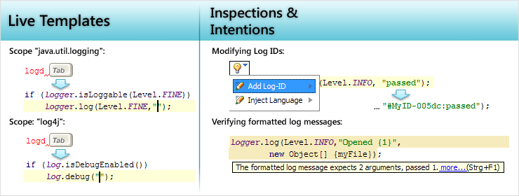
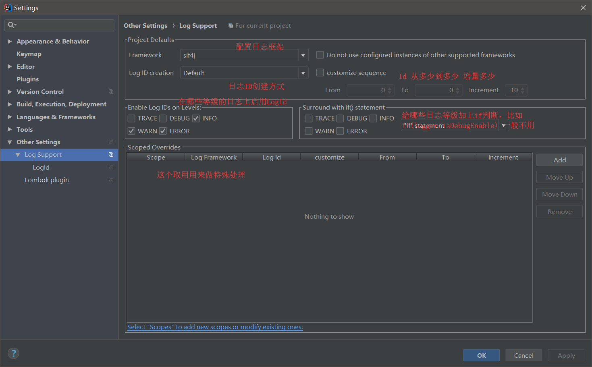
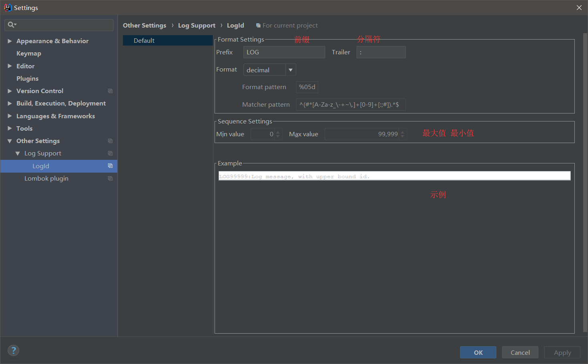

# IDEA Log Suppoert2插件

HomePage：http://logsupport.sourceforge.net/

Log Support2 插件是一个IDEA与日志相关的简单插件，编辑方面，主要包含两个简单实用的功能：

1. LiveTemplate 

   ```txt
   logt -> logger.trace()
   logd -> looger.debug()
   logi -> logger.info()
   logw -> logger.warn()
   loge -> logger.error()
   ```

2. LogId，日志过多时，给每条日志加上Id就会好找很多，LogSupport2通过Alt+Enter可以给已存在的日志语句加上日志ID。





配置LogId的生成方式：

