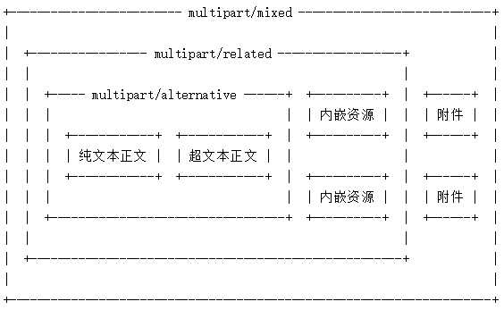

笔记参考来源：
> https://www.cnblogs.com/wuyoucao/archive/2017/05/19/6880202.html 感谢作者 烦嚣的人


# MIME 协议在邮件中的应用

## 定义

全称是多用途互联网邮件扩展（MIME，Multipurpose Internet Mail Extensions），在MIME出台之前，使用RFC 822只能发送基本的ASCII码文本信息，邮件内容如果要包括二进制文件、声音和动画等，实现起来非常困难，最为麻烦的是多家邮件服务器商间邮件的互发，如果没有一种统一的格式定义，想要互发需要投入巨大的人力物力。MIME提供了一种可以在邮件中附加多种不同编码文件的方法，弥补了原来的信息格式的不足。实际上不仅仅是邮件编码，现在MIME经成为HTTP协议标准的一个部分。

## 组成
MIME消息由**消息头**和**消息体**两大部分组成。


### 邮件头
MIME邮件的邮件头包含了发件人、收件人、主题、时间、MIME版本、邮件内容的类型等重要信息，常见的邮件头如下：

| 域名	    |含义	        |添加者        |
|-----------|---------------|--------------|
| Received	|传输路径	    |各级邮件服务器|
| Return-Path|回复地址|目标邮件服务器|
| Delivered-To|发送地址|目标邮件服务器|
| Reply-To|回复地址|邮件的创建者|
| From  |发件人地址	|邮件的创建者|
| To	|收件人地址	|邮件的创建者|
| Cc	|抄送地址	|邮件的创建者|
| Bcc	|暗送地址	|邮件的创建者|
| Date	|日期和时间	|邮件的创建者|
| Subject	|主题	|邮件的创建者|
| Message-ID|	消息ID	邮件的创建者|
| MIME-Version	|MIME版本|	邮件的创建者|
| Content-Type	|内容的类型	|邮件的创建者|
| Content-Transfer-Encoding	|内容的传输编码方式	邮件的创建者|

#### 邮件类型 ContentType
表示邮件的邮件体的类型，一般以`Content-Type: [type]/[subtype]; parameter` 的格式出现。

type可选值如下：

|type       |作用 |
|----|----|
|Text       |用于标准化地表示的文本信息，文本消息可以是多种字符集和或者多种格式的；|
|Multipart  |用于连接消息体的多个部分构成一个消息，这些部分可以是不同类型的数据；|
|Application|用于传输应用程序数据或者二进制数据；|
|Message    |用于包装一个E-mail消息；|
|Image      |用于传输静态图片数据；|
|Audio      |用于传输音频或者音声数据；|
|Video      |用于传输动态影像数据，可以是与音频编辑在一起的视频数据格式。|

subtype用于指定type的详细形式。content-type/subtype配对的集合和与此相关的参数，为了确保这些值在一个有序而且公开的状态下开发，MIME使用Internet Assigned Numbers Authority (IANA)作为中心的注册机制来管理这些值。常用的subtype值如下所示：

|subtype|作用|
|-----|-----|
|text/plain |纯文本|
|text/html|HTML文档|
|application/xhtml+xml|XHTML文档|
|image/gif|GIF图像|
|image/jpeg|JPEG图像|
|image/png|PNG图像|
|video/mpeg|MPEG动画|
|application/octet-stream|任意的二进制数据|
|application/pdf|PDF文档|
|application/msword|Microsoft Word文件|
|message/rfc822|RFC 822形式|
|multipart/alternative|HTML邮件的HTML形式和纯文本形式，相同内容使用不同形式表示|
|application/x-www-form-urlencoded|使用HTTP的POST方法提交的表单|
|multipart/form-data|同上，但主要用于表单提交时伴随文件上传的场合|

parameter用于指定附件信息，通常用于指定text/plain和text/htm等的文字编码方式的charset参数。

**默认的subtype**:

|type|默认值|
|----|-----|
|Text|text/plain|
|Application|application/octet-stream|
|Multipart|multipart/mixed|

#### 内容传输编码 Content-Transfer-Encoding
用于指定邮件体编码，格式为 `Content-Transfer-Encoding: [mechanism]`，支持的值有`7bit`，`8bit`，`binary`，`quoted-printable`，`base64`

### 邮件体

邮件体内容丰富多样，既有纯文本，也有超文本、图片文字、视频、附件，那么如何表示邮件的类型？

如果Content-Type为 `text/plain; charset=GBK `则代表该邮件体是一个纯文本类型的邮件；但是如果邮件包含很多图片、文本、附件，则Content-Type为`multipart` 类型，邮件会被分为很多part(段)，每段又包含段头和段体：



所以，如果要发送一封包含附件的邮件，你的邮件的MIME类型应该为`multipart/mixed`

### 实例

纯文本：
```
Received: from 15616xxxxx$163.com ( [122.207.54.20] ) by
 ajax-webmail-wmsvr14 (Coremail) ; Fri, 19 May 2017 19:40:51 +0800 (CST)
X-Originating-IP: [122.207.54.20]
Date: Fri, 19 May 2017 19:40:51 +0800 (CST)
From: 15572483149 <15616xxxxxx@163.com>
To: 272xxxxx5@qq.com
Subject: ss
X-Priority: 3
X-Mailer: Coremail Webmail Server Version SP_ntes V3.5 build
 20160729(86883.8884) Copyright (c) 2002-2017 www.mailtech.cn 163com
Content-Transfer-Encoding: 7bit
Content-Type: text/plain; charset=GBK
MIME-Version: 1.0
Message-ID: <c756733.d8f8.15c2082a579.Coremail.1561610xxxx@163.com>
X-Coremail-Locale: zh_CN

我是文本内容
```

文本和超文本：
```
Received: from 15616104472$163.com ( [122.207.54.20] ) by
 ajax-webmail-wmsvr14 (Coremail) ; Fri, 19 May 2017 19:51:31 +0800 (CST)
X-Originating-IP: [122.207.54.20]
Date: Fri, 19 May 2017 19:51:31 +0800 (CST)
From: 15572483149 <1561610xxxx2@163.com>
To: 272xxxxx5@qq.com
Subject:   ss
X-Priority: 3
X-Mailer: Coremail Webmail Server Version SP_ntes V3.5 build
 20160729(86883.8884) Copyright (c) 2002-2017 www.mailtech.cn 163com
X-CM-CTRLDATA: hN4rXGZvb3Rlcl9odG09ODU6NDI1
Content-Type: multipart/alternative; 
    boundary="----=_Part_214835_1240140699.1495194691872"
MIME-Version: 1.0
Message-ID: <10858dc0.d9be.15c208c6920.Coremail.15616xxxx2@163.com>
X-Coremail-Locale: zh_CN

------=_Part_214835_1240140699.1495194691872
Content-Type: text/plain; charset=GBK
Content-Transfer-Encoding: base64

c3Nz
------=_Part_214835_1240140699.1495194691872
Content-Type: text/html; charset=GBK
Content-Transfer-Encoding: base64

PGRpdiBzdHlsZT0ibGluZS1oZWlnaHQ6MS43O2NvbG9yOiMwMDAwMDA7Zm9udC1zaXplOjE0cHg7
Zm9udC1mYW1pbHk6QXJpYWwiPnNzczwvZGl2Pjxicj48YnI+PHNwYW4gdGl0bGU9Im5ldGVhc2Vm
b290ZXIiPjxkaXYgaWQ9Im5ldGVhc2VfbWFpbF9mb290ZXIiPjxkaXYgc3R5bGU9ImJvcmRlci10
b3A6I0NDQyAxcHggc29saWQ7cGFkZGluZzoxMHB4IDVweDtmb250LXNpemU6MTVweDtjb2xvcjoj
Nzc3O2xpbmUtaGVpZ2h0OjIycHgiPjxhIGhyZWY9Imh0dHA6Ly95b3UuMTYzLmNvbS9pdGVtL2xp
c3Q/Y2F0ZWdvcnlJZD0xMDEwMDAwJnN1YkNhdGVnb3J5SWQ9MTAxNTAwMSZmcm9tPXdlYl9nZ19t
YWlsX2ppYW9iaWFvXzgiIHRhcmdldD0iX2JsYW5rIiBzdHlsZT0iY29sb3I6IzMzNjZGRjt0ZXh0
LWRlY29yYXRpb246bm9uZSI+ob7P3sqxob9NVUpJoaLArbfywM3C17XI1sbU7MnM1rG5qdDCv+60
us/EVND0vfYz1du826Ohz97KsTQ51KrG8KOswu3Jz8fAJmd0OyZndDsgJm5ic3A7PC9hPgogJm5i
c3A7ICZuYnNwOzwvZGl2PjwvZGl2Pjwvc3Bhbj4=
------=_Part_214835_1240140699.1495194691872--
```

文本，超文本，附件：
```
Received: from 15616104472$163.com ( [122.207.54.20] ) by
 ajax-webmail-wmsvr14 (Coremail) ; Fri, 19 May 2017 20:24:26 +0800 (CST)
X-Originating-IP: [122.207.54.20]
Date: Fri, 19 May 2017 20:24:26 +0800 (CST)
From: 15572483149 <15616104472@163.com>
To: 2728474645@qq.com
Subject: ss
X-Priority: 3
X-Mailer: Coremail Webmail Server Version SP_ntes V3.5 build
 20160729(86883.8884) Copyright (c) 2002-2017 www.mailtech.cn 163com
X-CM-CTRLDATA: pQoIAGZvb3Rlcl9odG09ODY6NDI1
Content-Type: multipart/mixed; 
    boundary="----=_Part_217443_152692695.1495196666093"
MIME-Version: 1.0
Message-ID: <60b56d3.dc89.15c20aa88ed.Coremail.15616104472@163.com>
X-Coremail-Locale: zh_CN

------=_Part_217443_152692695.1495196666093
Content-Type: multipart/alternative; 
    boundary="----=_Part_217445_839318381.1495196666093"

------=_Part_217445_839318381.1495196666093
Content-Type: text/plain; charset=GBK
Content-Transfer-Encoding: base64

c2RmYQ==
------=_Part_217445_839318381.1495196666093
Content-Type: text/html; charset=GBK
Content-Transfer-Encoding: base64

PGRpdiBzdHlsZT0ibGluZS1oZWlnaHQ6MS43O2NvbG9yOiMwMDAwMDA7Zm9udC1zaXplOjE0cHg7
Zm9udC1mYW1pbHk6QXJpYWwiPnNkZmE8L2Rpdj48YnI+PGJyPjxzcGFuIHRpdGxlPSJuZXRlYXNl
Zm9vdGVyIj48ZGl2IGlkPSJuZXRlYXNlX21haWxfZm9vdGVyIj48ZGl2IHN0eWxlPSJib3JkZXIt
dG9wOiNDQ0MgMXB4IHNvbGlkO3BhZGRpbmc6MTBweCA1cHg7Zm9udC1zaXplOjE1cHg7Y29sb3I6
Izc3NztsaW5lLWhlaWdodDoyMnB4Ij48YSBocmVmPSJodHRwOi8veW91LjE2My5jb20vaXRlbS9s
aXN0P2NhdGVnb3J5SWQ9MTAxMDAwMCZzdWJDYXRlZ29yeUlkPTEwMTUwMDEmZnJvbT13ZWJfZ2df
bWFpbF9qaWFvYmlhb184IiB0YXJnZXQ9Il9ibGFuayIgc3R5bGU9ImNvbG9yOiMzMzY2RkY7dGV4
dC1kZWNvcmF0aW9uOm5vbmUiPqG+z97KsaG/TVVKSaGiwK238sDNwte1yNbG1OzJzNaxuanQwr/u
tLrPxFTQ9L32M9XbvNujoc/eyrE0OdSqxvCjrMLtyc/HwCZndDsmZ3Q7ICZuYnNwOzwvYT4KICZu
YnNwOyAmbmJzcDs8L2Rpdj48L2Rpdj48L3NwYW4+
------=_Part_217445_839318381.1495196666093--

------=_Part_217443_152692695.1495196666093
Content-Type: text/plain; name="first.txt"
Content-Transfer-Encoding: base64
Content-Disposition: attachment; filename="first.txt"

MTIzNA==
------=_Part_217443_152692695.1495196666093
Content-Type: text/plain; name="first.txt"
Content-Transfer-Encoding: base64
Content-Disposition: attachment; filename="first.txt"

MTIzNA==
------=_Part_217443_152692695.1495196666093--
```

包含所有东西：

```
Received: from 15616104472$163.com ( [122.207.54.20] ) by
 ajax-webmail-wmsvr14 (Coremail) ; Fri, 19 May 2017 20:37:12 +0800 (CST)
X-Originating-IP: [122.207.54.20]
Date: Fri, 19 May 2017 20:37:12 +0800 (CST)
From: 15572483149 <1561xxxxxx@163.com>
To: 1561xxxxxx@163.com
Subject: ss
X-Priority: 3
X-Mailer: Coremail Webmail Server Version SP_ntes V3.5 build
 20160729(86883.8884) Copyright (c) 2002-2017 www.mailtech.cn 163com
X-CM-CTRLDATA: WqpW62Zvb3Rlcl9odG09MjUzOjM5Mg==
Content-Type: multipart/mixed; 
    boundary="----=_Part_218429_202270086.1495197432753"
MIME-Version: 1.0
Message-ID: <6b289d2b.dd97.15c20b63bb1.Coremail.15616xxxx2@163.com>
X-Coremail-Locale: zh_CN

------=_Part_218429_202270086.1495197432753
Content-Type: multipart/related; 
    boundary="----=_Part_218430_777936326.1495197432753"

------=_Part_218430_777936326.1495197432753
Content-Type: multipart/alternative; 
    boundary="----=_Part_218431_95247708.1495197432753"

------=_Part_218431_95247708.1495197432753
Content-Type: text/plain; charset=GBK
Content-Transfer-Encoding: base64

c2Rm
------=_Part_218431_95247708.1495197432753
Content-Type: text/html; charset=GBK
Content-Transfer-Encoding: base64

PGRpdiBzdHlsZT0ibGluZS1oZWlnaHQ6MS43O2NvbG9yOiMwMDAwMDA7Zm9udC1zaXplOjE0cHg7
Zm9udC1mYW1pbHk6QXJpYWwiPjxkaXY+c2RmPC9kaXY+PGRpdj48aW1nIHNyYz0iY2lkOjQyZWE3
NDczJDIkMTVjMjBiNjNiYjEkQ29yZW1haWwkMTU2MTYxMDQ0NzIkMTYzLmNvbSIgb3Jnd2lkdGg9
IjQ4IiBvcmdoZWlnaHQ9IjQ4IiBkYXRhLWltYWdlPSIxIiBzdHlsZT0id2lkdGg6IDQ4cHg7IGhl
aWdodDogNDhweDsiPjwvZGl2PjwvZGl2Pjxicj48YnI+PHNwYW4gdGl0bGU9Im5ldGVhc2Vmb290
ZXIiPjxkaXYgaWQ9Im5ldGVhc2VfbWFpbF9mb290ZXIiPjxkaXYgc3R5bGU9ImJvcmRlci10b3A6
I0NDQyAxcHggc29saWQ7cGFkZGluZzoxMHB4IDVweDtmb250LXNpemU6MTZweDtjb2xvcjojNzc3
O2xpbmUtaGVpZ2h0OjIycHgiPjxhIGhyZWY9Imh0dHA6Ly95b3UuMTYzLmNvbS9pdGVtL21hbnVm
YWN0dXJlcj90YWdJZD0xMDAxMDAwJmZyb209d2ViX2FkX2ppYW9iaWFvMSIgdGFyZ2V0PSJfYmxh
bmsiIHN0eWxlPSJjb2xvcjojMzM2NkZGO3RleHQtZGVjb3JhdGlvbjpub25lIj6hvs340tfX1NOq
fDMwzOzO3tPHzcu79aG/zt7TocG8xrfWxtTsyczWsbmpu/m0obTytddU0PS1yLrDzu+jrM/eyrEy
OdSqxvAmZ3Q7Jmd0OzwvYT4KICZuYnNwOyAmbmJzcDs8L2Rpdj48L2Rpdj48L3NwYW4+
------=_Part_218431_95247708.1495197432753--

------=_Part_218430_777936326.1495197432753
Content-Type: image/png; name="circle.png"
Content-Transfer-Encoding: base64
Content-Disposition: inline; filename="circle.png"
Content-ID: <42ea7473$2$15c20b63bb1$Coremail$15616104472$163.com>

iVBORw0KGgoAAAANSUhEUgAAADAAAAAwCAQAAAD9CzEMAAAABGdBTUEAALGPC/xhBQAAACBjSFJN
AAB6JgAAgIQAAPoAAACA6AAAdTAAAOpgAAA6mAAAF3CculE8AAAAAmJLR0QA/4ePzL8AAAAHdElN
RQfaBBoAAAC1VYTSAAAEGElEQVRYw63Ye4hUZRjH8c/Mjpu6XtbcSjTZki1dK2VBCtPRIJSU2oyi
gsrAzL/CEC9kaPiHVBJBBaYUSYgRlRGZFV2MaPKKmhfU1Kxlt7y73lZXXXe2P86c2XGd3XXd8/wz
c2be5/d9n987c97nPTFtRvLKyy7iYtIuS+d+nGpDIXYN4l0MMNhQtytRqFC9Ov/aZ5cDzrYHibUj
fptxJiiXcNxBh51DQol++uuuxhrf2qGhdUSsDfE7PW+SAmutsdURZ13ODuruRkOM8aB+1lpqQ2Ba
qn1ARr7YFNPUWWGVqlzHU1euS7EHvKjcSu84mA8Ryys/zELDfGiZQ615nIMp8ohZzptr7dUjY3mS
JnjLIfNtaHv5WqzVa0ZZ4DPpKzMKrhr8hPf86iV7A/FqbUW1aqVwyk96mOOsPyjNySpoIf+Qd31h
rlPtzT0XUgoN1rnsFcfsyEUUtPB+qV+86vy1y+fUkbZFkRl2qmpGxHIAfSxXYLLjHRFvYXF37xvs
STWhRjxnxFSDzXP8OrRlKz5vgS5mSoSuxLPsoaZabGvHzMkTVRZ5zNjwMqwgZoojVnROPpO52ibT
dc8CkjBEpWVOdGbqWUS9JSqMDpTDCiqd8V2n7Qljve2eDn6hAaC3ib53NAr5TA1fut9tJMWTUG6g
H6KYejZ+w8jmCu5V68+I7AlUauw2KgTEVNijNtIKGmx0lx4BoEiZXVfushHEHiVuDgDFequKWJ5q
hUoCQE9dr/f+kz9SUKshBHSVaO4OIosLzukdLnKji5EDaBILAGkJPSKXT7hBfQCo16DXVV1cZ6On
bk4EgDPq9YtSOwn9pR0LALUOuyNyi8qcCQEX7TZMYcSAEf5xMrwXbTDIrVGtQhL6qrBRYwjYJO2+
SOdf4abg/xZPQbVNHtUlMvmYSf6ym7CCRp8bYXgUJiWhzDgr1ZESz9w5UvaboqCziEz2c85bHbwN
9+Q6i403JhKDKjxruf+CqTc3Xj9KmatvZ2rI9HZzHPRJ+Fk88AeXLHKLGddvUyZrqrHeaG4gMs1v
KRx3zGxnWjbgHZJ/2Js+8JEmGYUMINOC75Uw21E7O4pIhi+L/W6+C83bV/Z8UK2UJlsUm+m0HZpK
rxmSkR9viX1ediJ3d8w54VQrpdE63czWyzYXrqWOZFB7oSnettn04CjYnJXvjJYw2Tz7LbQ27DVS
eaWzUWaWSsstcrLl6NaOsSMtcLeVltmZD5IjPsBTXlDvdatcbvcYm5PcxzOm6e1nX9nsaJ6+qady
E1Xq6lMfq8lfa95HCdn5DVTpcWVO2mmb/Y6pk9ZVsYGGu8cAB33ja3+3bmSrD0OykB6GGq3CIMXS
LkmLizvrgO3W2x02PB18GHKV0wlFSvRSqMklp9Wq0xh+2VbL9j9IHjTiA2DrdAAAACV0RVh0ZGF0
ZTpjcmVhdGUAMjAxNi0wOS0xN1QxNToyMjo1NiswODowMJ6pg4wAAAAldEVYdGRhdGU6bW9kaWZ5
ADIwMTAtMDQtMjZUMDA6MDA6MDArMDg6MDCgVTtdAAAATXRFWHRzb2Z0d2FyZQBJbWFnZU1hZ2lj
ayA3LjAuMS02IFExNiB4ODZfNjQgMjAxNi0wOS0xNyBodHRwOi8vd3d3LmltYWdlbWFnaWNrLm9y
Z93ZpU4AAAAYdEVYdFRodW1iOjpEb2N1bWVudDo6UGFnZXMAMaf/uy8AAAAYdEVYdFRodW1iOjpJ
bWFnZTo6SGVpZ2h0ADEyOEN8QYAAAAAXdEVYdFRodW1iOjpJbWFnZTo6V2lkdGgAMTI40I0R3QAA
ABl0RVh0VGh1bWI6Ok1pbWV0eXBlAGltYWdlL3BuZz+yVk4AAAAXdEVYdFRodW1iOjpNVGltZQAx
MjcyMjExMjAwCSkN7wAAABJ0RVh0VGh1bWI6OlNpemUAMi4zMktCSJ1SyQAAAFt0RVh0VGh1bWI6
OlVSSQBmaWxlOi8vL2hvbWUvd3d3cm9vdC9zaXRlL3d3dy5lYXN5aWNvbi5uZXQvY2RuLWltZy5l
YXN5aWNvbi5jbi9zcmMvMjk3LzI5NzEyLnBuZ5u0pR4AAAAASUVORK5CYII=
------=_Part_218430_777936326.1495197432753--

------=_Part_218429_202270086.1495197432753
Content-Type: text/plain; name="first.txt"
Content-Transfer-Encoding: base64
Content-Disposition: attachment; filename="first.txt"

MTIzNA==
------=_Part_218429_202270086.1495197432753--
```